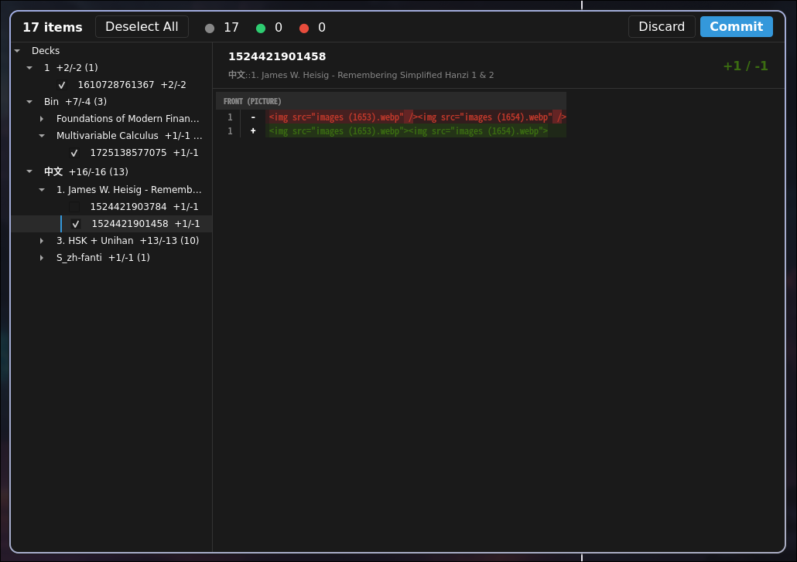
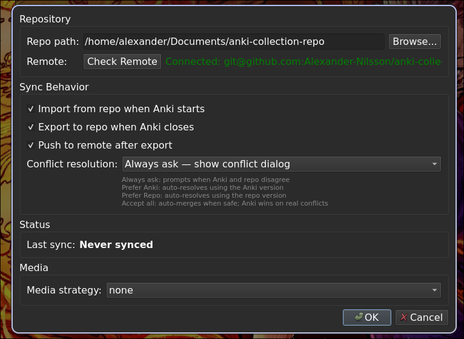

# AnkiGit — Git Version Control for Anki

**AnkiGit** is an Anki addon that provides Git-based version control for your Anki collections. Export your collection to a human-readable Git repo, track every change, collaborate on decks, and roll back to any point in history.

## Quick Install

Install directly from AnkiWeb:

**Anki Code:** `1384407975`

Or browse at <https://ankiweb.net/shared/info/1384407975>

### From source (development)

```bash
git clone <repo-url>
ln -s "$(pwd)/anki_git" ~/.local/share/Anki2/addons21/anki_git
```

## How It Works

AnkiGit exports every note in your collection as a standalone Markdown file inside a Git repository. Snapshots happen on demand or automatically on close — each commit records the full state of your collection in human-readable form.

### Example Note Format

Each note becomes `decks/<DeckName>/<nid>.md`:

```markdown
# Note
guid: dc6H$t-~MK
notetype: iKnow! Sentences

### Tags
languages
japanese
jp-sentences
jp-transportation

## Expression
駅からはタクシーに<b>乗って</b>ください。

## Meaning
Please take a taxi from the station.
乗る -- ride, take

## Reading
えき からは たくしー に <b>のって</b> ください

## Audio
[sound:e3c984736d8b1c2bdc467f2a1c98659a.mp3]

## Image_URI


## iKnowID
sentence:247153

## iKnowType
sentence
```

Notetypes are stored as YAML under `notetypes/<Name>/` with CSS separated into `style.css`.

### Screenshots

| Diff Preview | Settings |
|---|---|
|  |  |

## Features

- **Export** — snapshot your collection to a Git repo (one Markdown file per note)
- **Incremental export** — only re-export changed notes since the last snapshot
- **Import** — apply changes from your Git repo back into Anki
- **Selective import** — pick individual notes and notetypes to import via checkboxes
- **Diff preview** — git-style diff viewer before export/import
- **Conflict resolution** — three-way merge detection with a Qt dialog and auto-resolve modes
- **Notetype tracking** — clean YAML export with CSS separated into its own file
- **Auto-import on startup** — automatically check for repo changes when Anki opens
- **Auto-snapshot on close** — snapshot changes when Anki closes
- **Remote push** — auto-push to GitHub/GitLab after snapshot
- **Progress feedback** — animated progress bar with step-by-step status during operations

## Development

```bash
uv sync                           # create venv + install deps
uv run pytest tests/ -m "not integration"   # engine-layer tests only
uv run pytest tests/              # all tests (needs anki/aqt)
uv run ruff check anki_git/ tests/           # lint
uv run pyright anki_git/          # type check (engine layer)
python3 build.py all              # creates .ankiaddon in build/
```

## Architecture

See [`docs/architecture.md`](docs/architecture.md) for the full architecture overview, module dependency graph, core flow diagrams, and sequence diagrams.

## License

AGPL-3.0-only
