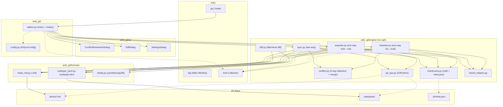
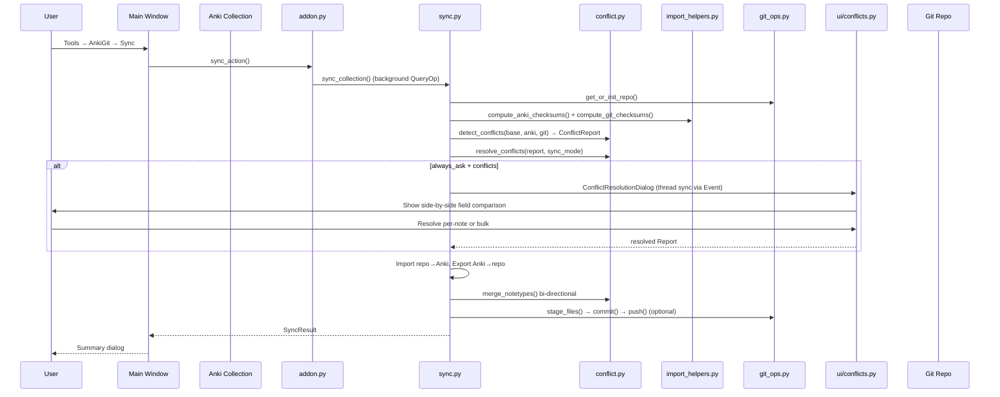
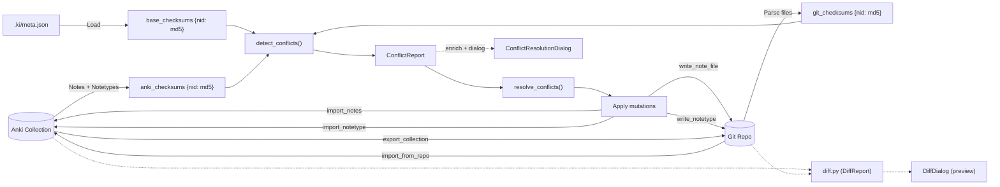

# AnkiGit — Architecture

## Complexity Notes

- **3 parallel data paths (export / import / sync) with ~40% duplicated logic** — each independently walks notes, notetypes, and checksums. `import_helpers.py` extracts shared import code, but no symmetric `export_helpers.py` exists.
- **Conflict system over-factored** — `detect_conflicts()` → `resolve_conflicts()` → `enrich_conflicts_with_content()` are always called sequentially; could be one function. `resolve_conflicts` and `merge_notetypes` duplicate the same 4-mode resolution logic for different structures.
- **Threading boilerplate repeated 4×** — `threading.Event()` + `mw.taskman.run_on_main()` for conflict and preview callbacks appears identically in sync, import, and startup-sync.
- **`meta.json` written twice per sync** — once for checksums, once for tracking metadata. Single write suffices.

---

## 1. Architecture



## 2. Core Flow

```mermaid
flowchart LR
    subgraph Export["One-Way Export"]
        direction TB
        E1["Open repo"] --> E2["Load meta.json (old checksums)"]
        E2 --> E3["Walk all notes → compute new checksums"]
        E3 --> E4["Write changed <nid>.md + notetypes"]
        E4 --> E5["Clean stale repo files"]
        E5 --> E6["Update meta.json → git commit"]
        E6 --> E7["Push (optional)"]
    end

    subgraph Import["One-Way Import"]
        direction TB
        I1["Load base checksums"] --> I2["Compute anki + git checksums"]
        I2 --> I3["detect_conflicts() (3-way)"]
        I3 --> I4["Resolve / prompt user"]
        I4 --> I5["Apply git-winning notes to Anki"]
        I5 --> I6["Delete resolved notes from both sides"]
        I6 --> I7["Import notetypes → update meta.json"]
    end

    subgraph Sync["Two-Way Sync"]
        direction TB
        S1["Load base checksums"] --> S2["Compute anki + git checksums"]
        S2 --> S3["detect_conflicts()"]
        S3 --> S4["resolve_conflicts() by sync_mode"]
        S4 --> S5["enrich conflicts with content"]
        S5 --> S6{"True conflicts + always_ask?"}
        S6 -->|Yes| S7["Conflict dialog"]
        S6 -->|No| S8
        S7 --> S8["Import (repo→Anki)"]
        S8 --> S9["Export (Anki→repo)"]
        S9 --> S10["Merge notetypes bi-directional"]
        S10 --> S11["Update checksums → commit → push"]
    end

    Export ~~~ Import ~~~ Sync

    style S10 stroke:#e74c3c,stroke-dasharray:5 5
    style I2 stroke:#f39c12,stroke-dasharray:5 5
    note placement="left" style S10 stroke:red,stroke-dasharray:5 5
```

## 3. Key Sequence: Two-Way Sync



## 4. Data Flow



### File format summary

| Path | Format |
|------|--------|
| `decks/<Deck>/<nid>.md` | `<!-- note: nid=N notetype=X tags=Y deck=Z -->` + `## FieldName` sections |
| `notetypes/<Name>/meta.json` | `{name, id, sort_field}` |
| `notetypes/<Name>/fields.json` | `[{name, ord, font?, size?, ...}]` |
| `notetypes/<Name>/templates.json` | `[{name, ord}]` + `front.html` / `back.html` per card |
| `notetypes/<Name>/style.css` | Plain CSS |
| `.ki/meta.json` | `{note_checksums, last_export_time, last_note_count, ...}` |
